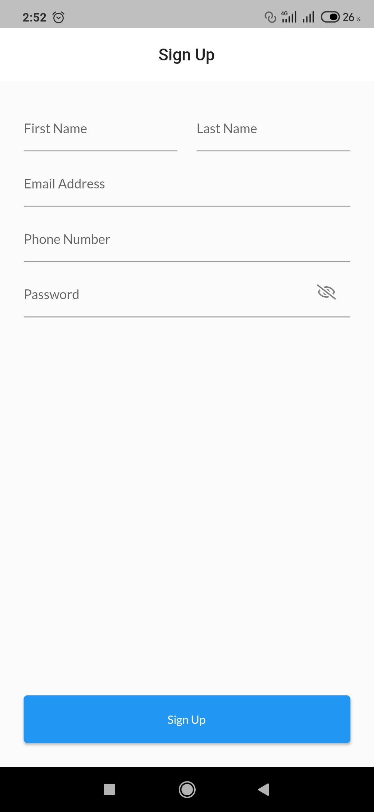
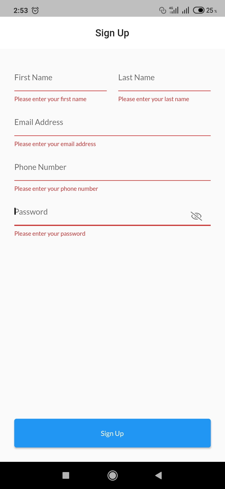
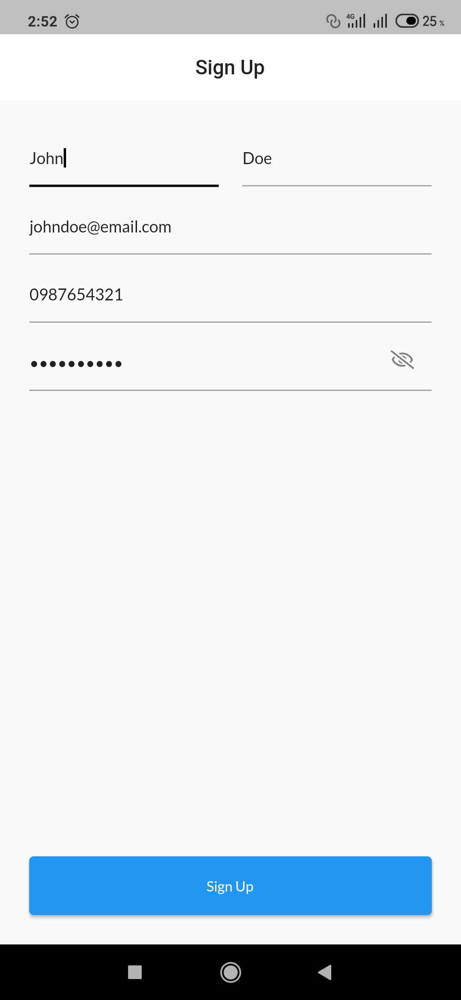
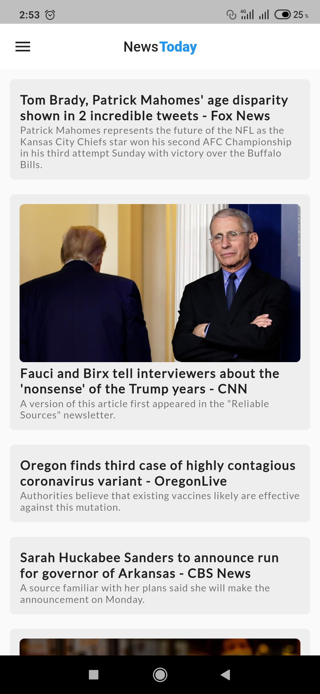
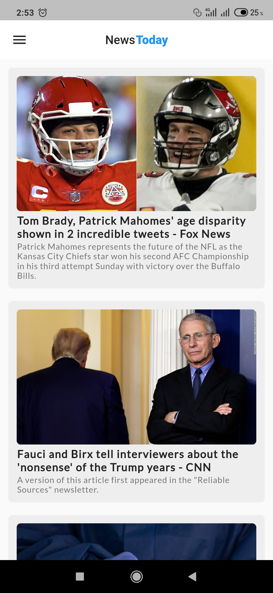
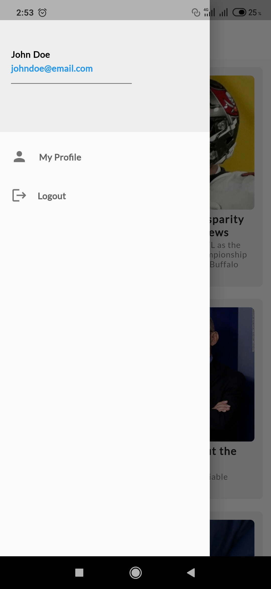
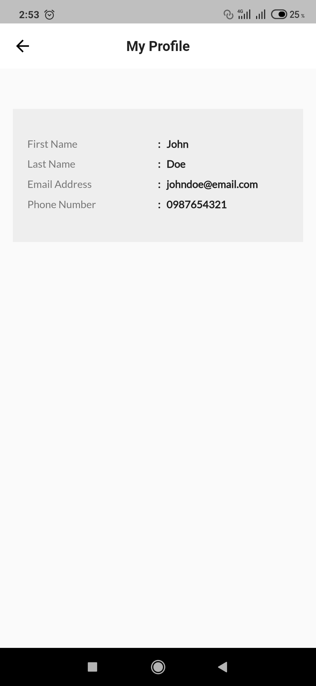

# NewsToday

A Flutter News App.

## Getting Started

I was able to load the top headlines on the home page using a free News Api provided by NewsApi.Org.

### 📕 Things covered in the app:

* Created a Sign Up view.
* Fetched data from NewsApi.org (API).
* Made use of useState in the app.
* Passed down data on widgets.
* Made use of the 'webview_flutter' package to display full details of a Headline when clicked on. 
* Also designed a complex User Interface.
* Created a 'Profile' view to display User information when clicked on.

### Sign Up Page
<!--  -->

### Home Page

### Drawer Page

### Profile Page

